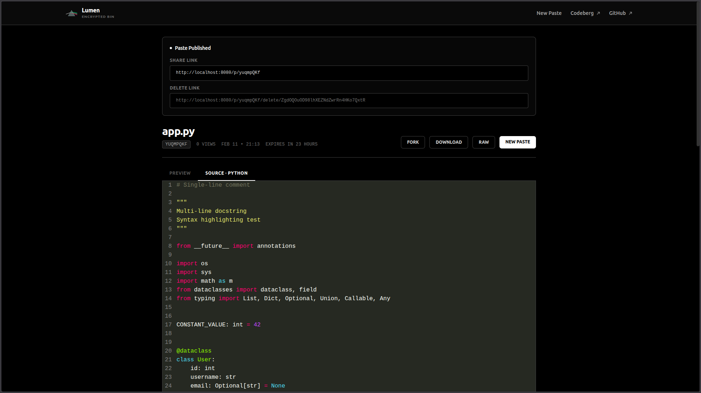
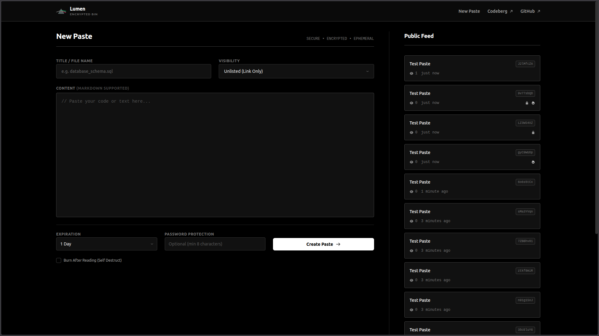
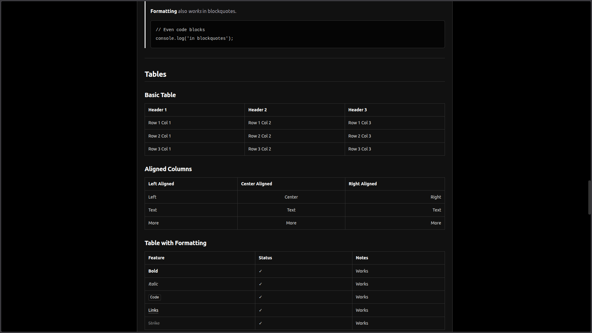
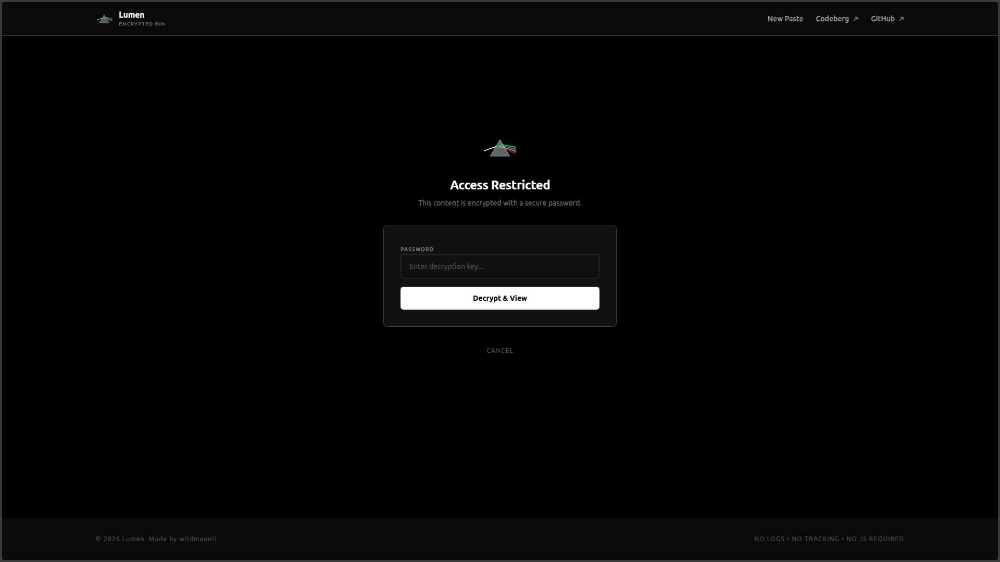
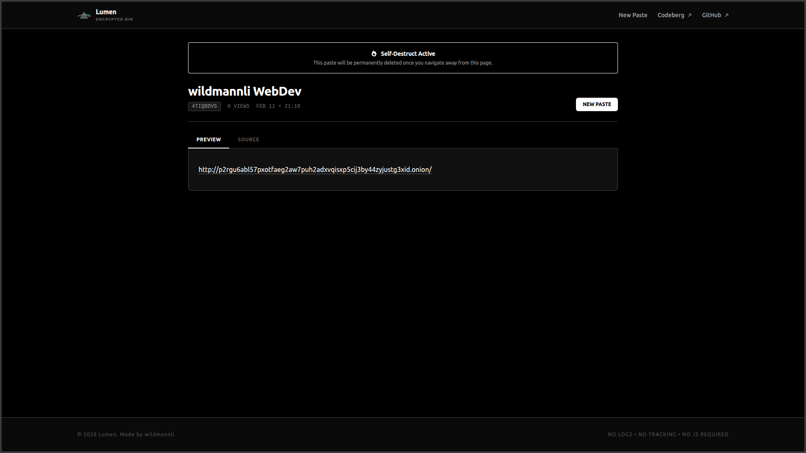

# Lumen

A privacy-focused, encrypted pastebin. No JavaScript, no accounts, no tracking.

## Features

- **Zero JavaScript** — pure server-rendered HTML with `script-src 'none'` CSP
- **End-to-end encryption** — password-protected pastes use AES-256-GCM with Argon2id key derivation
- **Burn after reading** — self-destructing pastes, atomically deleted on first view
- **Markdown rendering** — GitHub Flavored Markdown with preview/source tabs
- **Syntax highlighting** — automatic language detection from file extensions (server-side, via Chroma)
- **Expiration** — 10 minutes to 30 days, no permanent pastes
- **Fork & download** — clone pastes or download as files
- **Admin links** — delete your pastes via a unique token, no accounts needed
- **CSRF protection** — Double Submit Cookie pattern on all forms
- **Rate limiting** — IP-based limits on creation and viewing
- **Security headers** — CSP, HSTS, X-Frame-Options, no-cache, and more

## Showcase

### Homepage + Public Feed



### Admin View + Syntax Highlighting



### Markdown Rendering



### Password Protection



### Burn After Reading



## Quick Start

```bash
go build -o lumen .
./lumen
```

Server starts at `http://localhost:8080`.

## Configuration

Copy `.env.example` to `.env`:

```bash
cp .env.example .env
```

Then edit `.env` and set values for your deployment (at minimum `ENVIRONMENT=production` and `IP_HASH_SECRET` in production).

| Variable | Default | Description |
|----------|---------|-------------|
| `PORT` | `8080` | Server port |
| `ENVIRONMENT` | `development` | `production` disables debug logging |
| `DATABASE_PATH` | `./lumen.db` | SQLite database file |
| `MAX_PASTE_SIZE` | `524288` | Max paste size in bytes (512 KB) |
| `DEFAULT_EXPIRY` | `24h` | Default expiration |
| `MAX_EXPIRY` | `720h` | Maximum expiration (30 days) |
| `ID_LENGTH` | `8` | Paste ID length |
| `CREATE_RATE_LIMIT` | `10` | Max creations per IP per window |
| `VIEW_RATE_LIMIT` | `100` | Max views per IP per window |
| `RATE_WINDOW` | `1h` | Rate limit window |
| `TRUSTED_PROXIES` | — | Comma-separated proxy IPs/CIDRs |
| `IP_HASH_SECRET` | — | HMAC key for IP hashing — **set in production** |

## Project Structure

```
├── main.go              # Entry point, router, graceful shutdown
├── config/              # Environment-based configuration
├── database/            # SQLite init, migrations, expired paste cleanup
├── handlers/            # HTTP handlers (create, view, unlock, delete, fork, download)
├── middleware/           # Security headers, CSRF, rate limiting
├── models/              # Paste model and database queries
├── utils/               # Crypto (Argon2, AES-GCM), markdown, syntax highlighting, ID generation
├── templates/           # Go HTML templates
├── src/input.css        # Tailwind CSS source
└── static/              # Compiled CSS and icons
```

## Security

- Strict CSP with `script-src 'none'` — no JavaScript, no XSS surface
- Cryptographically random paste IDs (62^n combinations)
- IP addresses stored as HMAC-SHA256 hashes, never in plaintext
- Password-protected pastes encrypted at rest with AES-256-GCM
- Burn-after-reading uses atomic `DELETE ... RETURNING` — guaranteed single read
- HTML sanitized via Bluemonday as defense-in-depth
- CSRF tokens on all state-changing forms
- Graceful shutdown with in-flight request draining

## Building CSS

Tailwind is compiled locally (no CDN):

```bash
npm install
npx @tailwindcss/cli -i src/input.css -o static/styles.css --minify
```

## Author

Made by **wildmannli** 
Website: `http://p2rgu6abl57pxotfaeg2aw7puh2adxvqisxp5cij3by44zyjustg3xid.onion`

## License

AGPL-3.0
